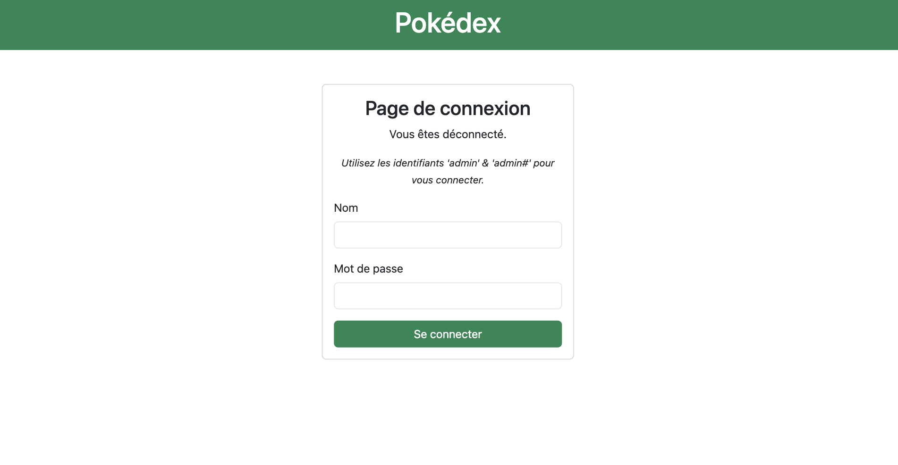
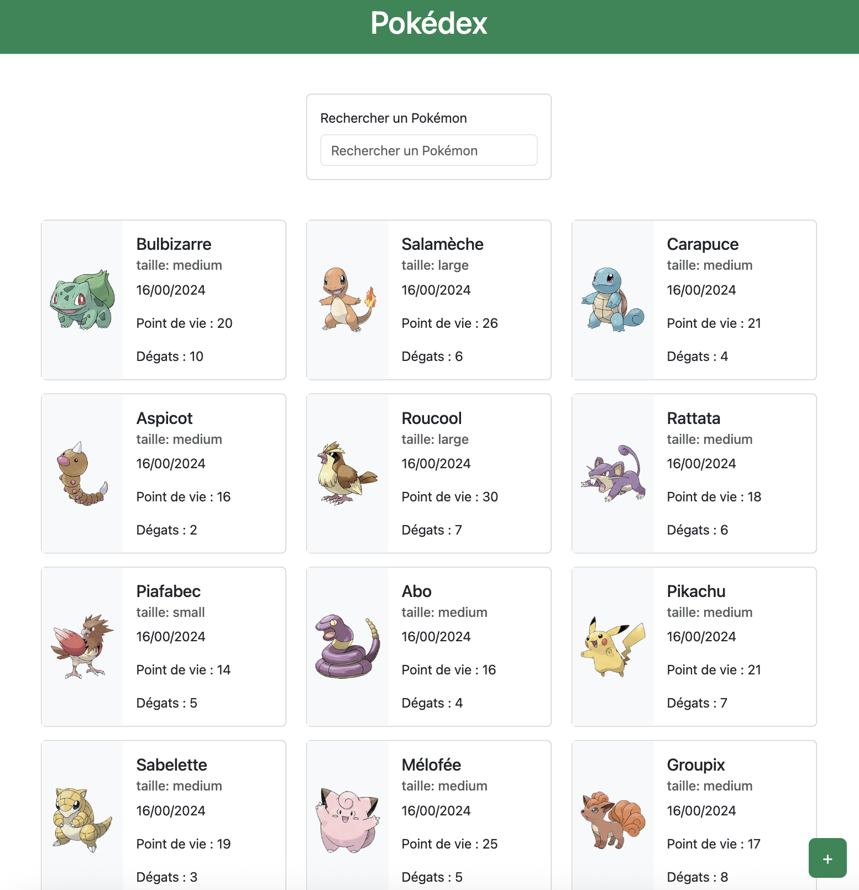
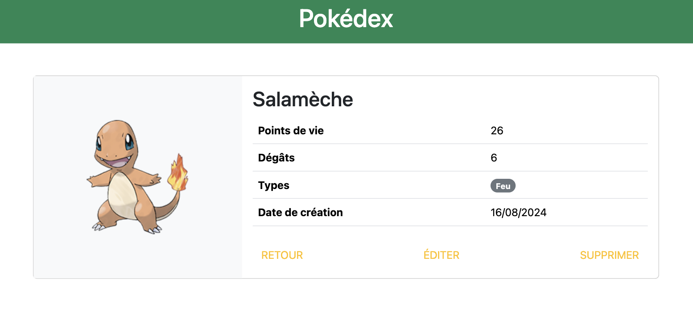
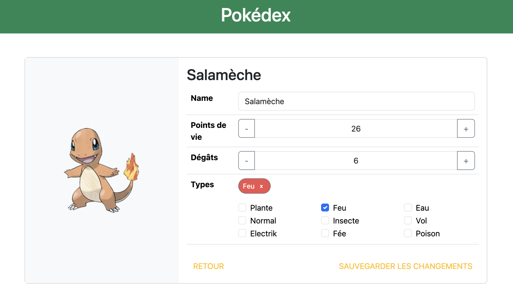
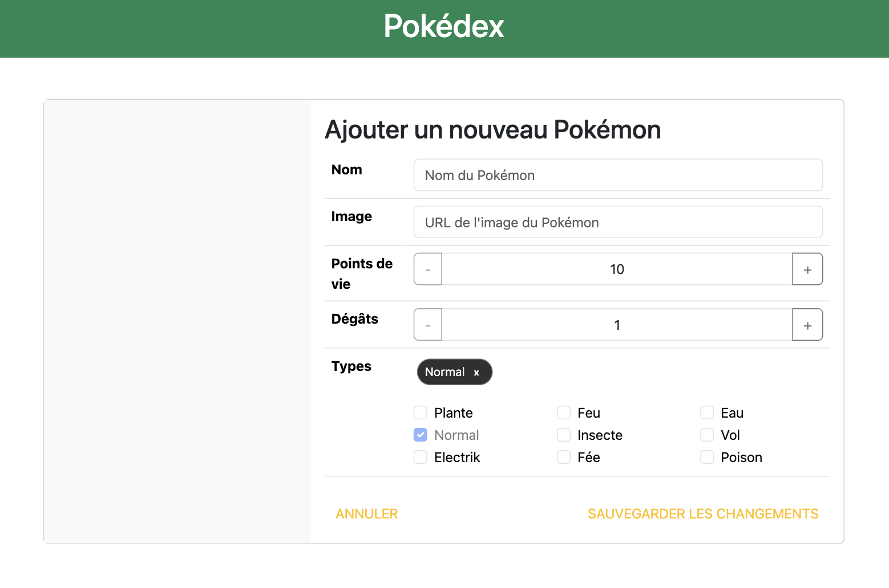

# Angular Card App

Projet réalisé dans le cadre de la formation Angular de Simon DIENY (expert Angular) via Udemy.
Cette application a été construite pour mettre en pratique les concepts clés d’Angular avec une API simulée.

## 🚀 Fonctionnalités

- Affichage des cartes via une API locale (`json-server`)
- Utilisation d’Angular (version 19)
- Composants Angular modulaires
- Chargement dynamique des données

## 🛠️ Stack technique

- **Frontend** : Angular 19
- **Backend**  : NodeJs
- **Langages** : TypeScript, HTML, CSS

## 🎨 Présentation visuelle

### Modale de connexion
Une modale permet à l'utilisateur de se connecter via un formulaire accessible depuis la barre de navigation.

### Page d'accueil
Affiche la liste des Pokémon sous forme de cartes avec leurs noms, images et types. Un bouton permet d'accéder aux différentes équipes Pokémon.

### Détail d'un Pokémon
En cliquant sur une carte, une fenêtre modale s’ouvre pour afficher les détails complets du Pokémon sélectionné : nom, image, types, statistiques, etc.

### Édition d'un Pokémon
Depuis le détail, il est possible d’ouvrir un formulaire pour modifier les informations du Pokémon (nom, types, points de vie, dégâts).

### Ajout d'un Pokémon
Une fonctionnalité permet d'ajouter un nouveau Pokémon via un formulaire dédié accessible depuis la page d'accueil ou la barre de navigation.

- Ce projet est une excellente base pour apprendre Angular en mettant en pratique la gestion d’une API locale, la manipulation de composants, et l’interactivité via des modales.

---

